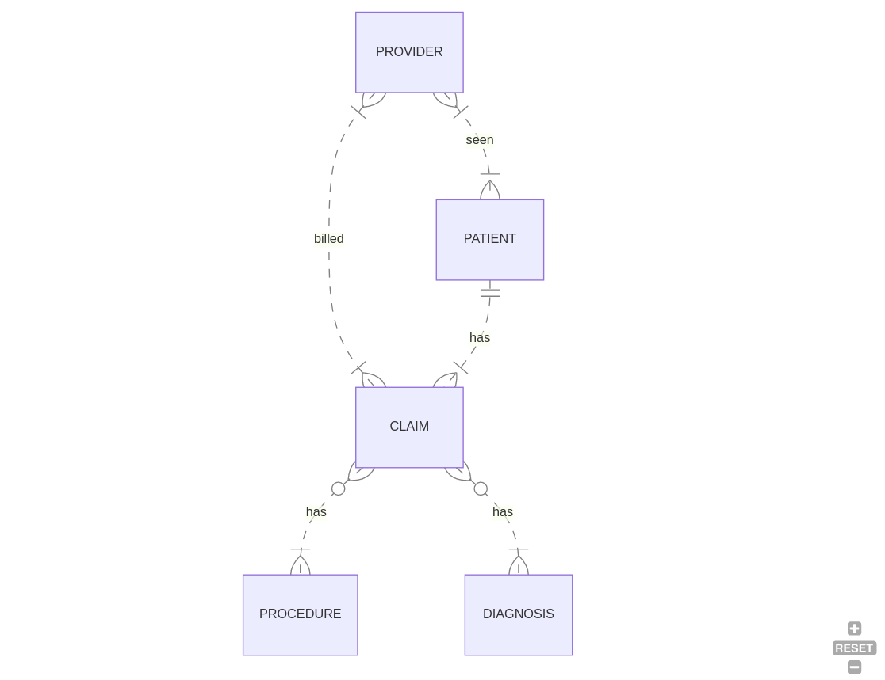

# Design Document

By Kevin Jamito

Video overview: <URL>

## Scope

My project is a mock representation of a simple medical billing for a healthcare provider's office.

* The purpose of this database is to represent a medical billing software tracking claims for patients
* Which people, places, things, etc. are you including in the scope of your database?
* Which people, places, things, etc. are *outside* the scope of your database?

## Functional Requirements

Here are the functional requirements of the project

* Authorized users such as the medical practice owner(doctor), medical billing manager or the accounts receivable claims analyst can query information about claims
* What's beyond the scope of what a user should be able to do with your database?

## Representation

### Entities

Here are the entities that are represented in my database

* Medical Provider -
* What attributes will those entities have?
* Why did you choose the types you did?
* Why did you choose the constraints you did?
* Patients -
* Claims -
* Procedures -
* Diagnosis -

### Relationships

In this section you should include your entity relationship diagram and describe the relationships between the entities in your database.

## Optimizations

* Which optimizations (e.g., indexes, views) did you create? Why?

## Limitations

* What are the limitations of your design?
* What might your database not be able to represent very well?
